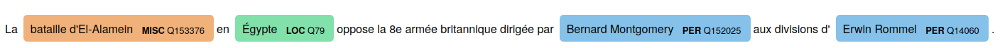

# spaCy fishing

 [](https://badge.fury.io/py/spacyfishing) [](https://opensource.org/licenses/MIT) [](https://github.com/Lucaterre/spacyfishing/actions/workflows/tests.yml) [](https://spacy.io)

<!-- add pip badge -->

A spaCy wrapper of [Entity-Fishing](https://nerd.readthedocs.io/en/latest/overview.html), a tool for named entity disambiguation and linking on Wikidata.

This extension allows using Entity-Fishing tool as a spaCy pipeline component to disambiguate and link named entities (with custom or pretrained NER spaCy models) to Wikidata knowledge base.

## Table of contents

 * [Installation](#Installation)
   * [normal](#normal)
   * [development](#development)
 * [Usage (examples)](#Usage)
 * [Configuration parameters](#Configuration-parameters)
 * [Attributes](#Attributes)
 * [Recommendations](#Recommendations)
 * [Visualise results](#Visualise-results) 
 * [External Ressources](#External-ressources)


## Installation

### normal

```bash
pip install spacyfishing
```

### development

```bash
git clone https://github.com/Lucaterre/spacyfishing.git
virtualenv --python=/usr/bin/python3.8 venv
source venv/bin/activate
pip install -r requirements.txt
```

## Usage


First, install a [pre-trained spaCy language model](https://spacy.io/models) for the NER task:

```bash
python -m spacy download en_core_web_sm
```

Note that it is possible to use custom NER model.

### Simple example

```Python
import spacy 

text_en = "Victor Hugo and Honoré de Balzac are French writers who lived in Paris."

nlp_model_en = spacy.load("en_core_web_sm")

nlp_model_en.add_pipe("entityfishing")

doc_en = nlp_model_en(text_en)

for ent in doc_en.ents:
        print((ent.text, ent.label_, ent._.kb_qid, ent._.url_wikidata, ent._.nerd_score))
```
```
('Victor Hugo', 'PERSON', 'Q535', 'https://www.wikidata.org/wiki/Q535', 0.972)
('Honoré de Balzac', 'PERSON', 'Q9711', 'https://www.wikidata.org/wiki/Q9711', 0.9724)
('French', 'NORP', 'Q121842', 'https://www.wikidata.org/wiki/Q121842', 0.3739)
('Paris', 'GPE', 'Q90', 'https://www.wikidata.org/wiki/Q90', 0.5652)
```

### Get Wikidata description

By default, the Wikidata entity description is not provided, to access it, 
specify `True` in the `description_required` parameter in the component configuration:

```Python

import spacy 

text_en = "Victor Hugo and Honoré de Balzac are French writers who lived in Paris."

nlp_model_en = spacy.load("en_core_web_sm")

# specify configuration:
nlp_model_en.add_pipe("entityfishing", config={"description_required": True})

doc_en = nlp_model_en(text_en)

# Access to description with ent._.description:
for ent in doc_en.ents:
        print((ent.text, ent.label_, ent._.kb_qid, ent._.description))
```
```
('Victor Hugo', 'PERSON', 'Q535', "'''''' (; 26 February 1802 – 22 May 1885) was a French poet, novelist, and dramatist of the [[Romanticism|Romantic movement]]. Hugo is considered to be one of the greatest and best-known French writers. Outside of France, his most famous works are the novels '''', 1862, and ''[[The Hunchback of Notre-Dame]]'', 1831. In France, Hugo is known primarily for his poetry collections, such as '''' (''The Contemplations'') and '''' (''The Legend of the Ages'').")
('Honoré de Balzac', 'PERSON', 'Q9711', "'''Honoré de Balzac''' (;, born '''Honoré Balzac''', 20 May 1799 \xa0 – 18 August 1850) was a French novelist and playwright. The [[novel sequence]] ''[[La Comédie Humaine]]'', which presents a panorama of [[Napoleonic Era|post-Napoleonic]] French life, is generally viewed as his ''[[Masterpiece|magnum opus]]''.")
('French', 'NORP', 'Q121842', "The '''French''' are an [[ethnic group]] and [[nation]] who are identified with the country of [[France]]. This connection may be legal, historical, or cultural.")
('Paris', 'GPE', 'Q90', "'''Paris''' is the [[Capital city|capital]] and most populous [[city]] of [[France]], with an administrative-limits area of and a 2015 population of 2,229,621. The city is a [[Communes of France|commune]] and [[Departments of France|department]], and the capital-heart of the [[Île-de-France]] ''[[Region in France|region]]'' (colloquially known as the 'Paris Region'), whose 12,142,802 2016 population represents roughly 18 percent of the population of France. By the 17th century, Paris had become one of Europe's major centres of finance, commerce, fashion, science, and the arts, a position that it retains still today. The Paris Region had a [[GDP]] of €649.6 billion (US $763.4 billion) in 2014, accounting for 30.4 percent of the GDP of France. According to official estimates, in 2013-14 the Paris Region had [[List of cities by GDP|the third-highest GDP in the world and the largest regional GDP in the EU]].")
```

### Use other languages

By default, disambiguation model resources are set to English, to use other languages, specify the language code in the `language` parameter in the component configuration:

```Python
import spacy 

text_fr = "La bataille d'El-Alamein en Égypte oppose la 8e armée britannique dirigée par Bernard Montgomery aux divisions d'Erwin Rommel."

nlp_model_fr = spacy.load("fr_core_news_sm")

nlp_model_fr.add_pipe("entityfishing", config={"language": "fr"})

doc_fr = nlp_model_fr(text_fr)

for ent in doc_fr.ents:
        print((ent.text, ent.label_, ent._.kb_qid, ent._.url_wikidata))
```
```
("bataille d'El-Alamein", 'MISC', 'Q153376', 'https://www.wikidata.org/wiki/Q153376')
('Égypte', 'LOC', 'Q79', 'https://www.wikidata.org/wiki/Q79')
('Bernard Montgomery', 'PER', 'Q152025', 'https://www.wikidata.org/wiki/Q152025')
('Erwin Rommel', 'PER', 'Q14060', 'https://www.wikidata.org/wiki/Q14060')
```

To consult the languages available in Entity-Fishing follow this [link](https://nerd.readthedocs.io/en/latest/restAPI.html#supported-languages).

### Get information about Entity-fishing API response

The raw response of the Entity-fishing API can be accessed in the doc object:

```
doc._.annotations
```
```
{'runtime': 18, 
 'nbest': False, 
 'text': "La bataille d'El-Alamein en Égypte oppose la 8e armée britannique dirigée par Bernard Montgomery aux divisions d'Erwin Rommel.", 
 'language': {'lang': 'fr', 'conf': 0.0}, 
 'global_categories': [
  {'weight': 0.01960784313725492, 'source': 'wikipedia-fr', 'category': 'Général allemand', 'page_id': 94081}, 
  {'weight': 0.01960784313725492, 'source': 'wikipedia-fr', 'category': "Chevalier grand-croix de l'ordre du Bain", 'page_id': 3399090}, 
  {'weight': 0.01960784313725492, 'source': 'wikipedia-fr', 'category': 'Naissance à Heidenheim an der Brenz', 'page_id': 8396804}
  ], 
  'entities': [
  {'rawName': "bataille d'El-Alamein", 'offsetStart': 1, 'offsetEnd': 6, 'nerd_score': 1, 'nerd_selection_score': 0.9198, 'wikipediaExternalRef': 261761, 'wikidataId': 'Q153376', 'domains': ['Military']},
  {'rawName': 'Égypte', 'offsetStart': 7, 'offsetEnd': 8, 'nerd_score': 1, 'nerd_selection_score': 0.6437, 'wikipediaExternalRef': 4011, 'wikidataId': 'Q79', 'domains': ['Geology']}, 
  {'rawName': 'Bernard Montgomery', 'offsetStart': 15, 'offsetEnd': 17, 'nerd_score': 1, 'nerd_selection_score': 0.9965, 'wikipediaExternalRef': 46225, 'wikidataId': 'Q152025', 'domains': ['Biology', 'Military']}, 
  {'rawName': 'Erwin Rommel', 'offsetStart': 20, 'offsetEnd': 22, 'nerd_score': 1, 'nerd_selection_score': 0.9955, 'wikipediaExternalRef': 46221, 'wikidataId': 'Q14060', 'domains': ['Military']}
  ]
 }
```

To access to query metadata for the response by Entity-Fishing API :

```
doc._.metadata
```
```
{'status_code': 200, 'reason': 'OK', 'ok': True, 'encoding': 'utf-8'}
```

## Configuration parameters

```
- api_ef_base          : URL of the entity-fishing API endpoint. Defaults to Huma-Num server.
- language             : Specify language of KB ressources for entity-fishing API. Defaults to "en".
- description_required : Get Wikidata description from service "concept look-up" of entity-fishing API. Defaults to false. 
```

## Attributes

---

* **Doc** extensions:

   ```
   doc._.annotations :  Raw response from Entity-Fishing API.
   doc._.metadata    :  Raw information about request and response from Entity-Fishing API.
   ```

* **Span** extensions:

   ```
   span._.kb_qid       : Wikidata identifier (QID). 
   span._.description  : Short Wikidata description.
   span._.url_wikidata : URL to Wikidata ressource.
   span._.nerd_score   : Selection confidence score for the disambiguated entity.
   ```

For details on Entity-Fishing response, follow this [link](https://nerd.readthedocs.io/en/latest/restAPI.html#response)

## Recommendations

If Entity-fishing is deployed locally or on specific server, specify the URL of the new Entity-fishing API endpoint in the config:

```
nlp.add_pipe("entityfishing", config={"api_ef_base": "<api-endpoint>"})
```

This can be useful, if you work with more recent dumps of Wikidata knowledge base or increase speed in the pipeline.

To install your own instance of Entity-Fishing, follow this [link](https://nerd.readthedocs.io/en/latest/build.html).

## Visualise results

To visualize the named entities and their wikidata links, use the manual option of displaCy:

```Python
import spacy 

text_fr = "La bataille d'El-Alamein en Égypte oppose la 8e armée britannique dirigée par Bernard Montgomery aux divisions d'Erwin Rommel."
nlp_model_fr = spacy.load("fr_core_news_sm")
nlp_model_fr.add_pipe("entityfishing", config={"language": "fr"})
doc_fr = nlp_model_fr(text_fr)

options = {
    "ents": ["MISC", "LOC", "PER"],
    "colors": {"LOC": "#82e0aa", "PER": "#85c1e9", "MISC": "#f0b27a"}
}

params = {"text": doc_fr.text,
          "ents": [{"start": ent.start_char,
                    "end": ent.end_char,
                    "label": ent.label_,
                    "kb_id": ent._.kb_qid,
                    "kb_url": ent._.url_wikidata}
                     for ent in doc_fr.ents],
          "title": None}

spacy.displacy.serve(params, style="ent", manual=True, options=options)
```



The visualizer is serving on http://0.0.0.0:5000

## External Ressources

- [spaCy homepage](https://spacy.io/)
- [spaCy GitHub](https://github.com/explosion/spaCy)


- [Entity-Fishing GitHub](https://github.com/kermitt2/entity-fishing)
- [Entity-Fishing web client](http://nerd.huma-num.fr/nerd/)
- [Entity-Fishing documentation](https://nerd.readthedocs.io/en/latest/)

## Specifications

This component is experimental, it may be used for research, and it may evolve in the future.

The structure component was inspired by another spacy extension called [spaCyOpenTapioca](https://github.com/UB-Mannheim/spacyopentapioca).

Entity-Fishing is tool created by Patrice Lopez (SCIENCE-MINER), with contributions of Inria Paris, and distributed under Apache 2.0 license. 
